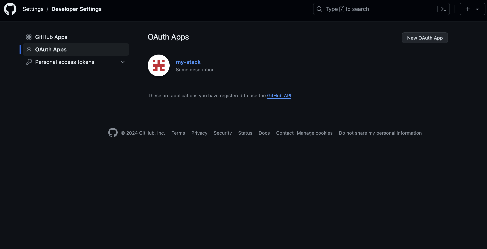

This is a Boilerplate made by [Cyprien Fiquet](https://cyprienfiquet.com) in [Next.js](https://nextjs.org/) with [React](https://fr.react.dev/), [Prisma](https://www.prisma.io/), [Auth.js](https://authjs.dev/) and [Stripe](https://stripe.com/). You can use [TailwindCss] and this app run with [Shadcn/ui]

## Getting Started

First, run the development server:

```bash
npm run dev
# or
yarn dev
# or
pnpm dev
# or
bun dev
```

Open [http://localhost:3000](http://localhost:3000) with your browser to see the result.

You can start editing the page by modifying `app/page.tsx`. The page auto-updates as you edit the file.

This project uses [`next/font`](https://nextjs.org/docs/basic-features/font-optimization) to automatically optimize and load Inter, a custom Google Font.

## Learn More

To learn more about Next.js, take a look at the following resources:

- [Next.js Documentation](https://nextjs.org/docs) - learn about Next.js features and API.
- [Learn Next.js](https://nextjs.org/learn) - an interactive Next.js tutorial.

You can check out [the Next.js GitHub repository](https://github.com/vercel/next.js/) - your feedback and contributions are welcome!

To run the project don't forget to add environnement vairables ! and rename the file `.env.example` into `.env`.
For the rest you only need to configure github ans google to connect with `OAuth`
For gitHub :


And Google :
[SEE HERE](https://console.cloud.google.com/apis/dashboard)
In this page you can create an application, add you app with Oauth and after that get client and secret

For Stripe you just need to create an account and create products
/!\ WARNING !!! this app work only with subscription type products for now !!!!!
After that you can run localy the webhook listener and try to buy somethings with BuyButton component

## Deploy on Vercel

The easiest way to deploy your Next.js app is to use the [Vercel Platform](https://vercel.com/new?utm_medium=default-template&filter=next.js&utm_source=create-next-app&utm_campaign=create-next-app-readme) from the creators of Next.js.

Check out our [Next.js deployment documentation](https://nextjs.org/docs/deployment) for more details.
